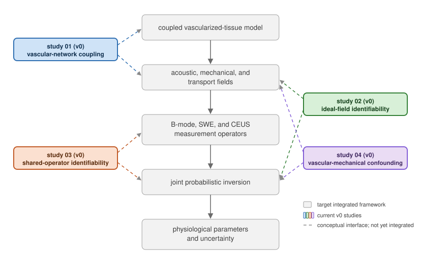

# Computational studies toward multiphysics ultrasound

Multiparametric ultrasound combines measurements of tissue structure,
mechanical response, and vascular transport. Measurements can be linked in two ways: 
they may depend on the same tissue property and they may carry the same acquisition effect. 
Joint parameter estimation requires a model of each form of coupling. 
This repository contains four simulation studies that isolate specific parts of
this problem. Studies 01-03 examine vascular coupling, ideal-field
identifiability, and measurement-operator coupling separately. Study 04 connects
the vascular networks from study 01 to a reduced SWE-CEUS inference problem.

The studies are initial (`v0`) steps toward a future integrated framework.



*Proposed framework. The colored boxes indicate the four studies included in
this repository. The dashed arrows locate each study within the proposed
framework; they do not indicate fully integrated software interfaces.*

## Studies

| Directory | Aim | Main result |
|---|---|---|
| [`01-vascular-network-coupling`](studies/01-vascular-network-coupling/RESULTS.md) | Determine whether vascular architecture affects mechanical relaxation and contrast transport in the same vascularized tissue model. | Increasing the modeled tortuosity parameter by 16% lengthened vascular-compliance relaxation by approximately 33% and reduced estimated transport drift and dispersion by approximately 22% and 28%, respectively, in five paired prostate-gland realizations. |
| [`02-multiphysics-field-identifiability`](studies/02-multiphysics-field-identifiability/RESULTS.md) | Assess parameter identifiability from idealized mechanical and contrast-transport fields. | Absolute contrast constrained the vascular volume fraction when the input concentration was calibrated. Effective permeability remained unresolved by the tested SWE-CEUS model. A network-informed coupling narrowed its posterior but produced large bias when the relation was misspecified. |
| [`03-shared-operator-identifiability`](studies/03-shared-operator-identifiability/RESULTS.md) | Test whether a shared measurement parameter can reduce operator-tissue confounding. | A calibrated relation between sequence-specific image widths transferred information from a contrast time series to B-mode and substantially reduced uncertainty in the intrinsic lesion-margin width. |
| [`04-vascular-mechanical-confound`](studies/04-vascular-mechanical-confound/RESULTS.md) | Test whether a network-derived CEUS observation can reduce confounding between vascular constriction and matrix viscoelasticity in SWE. | Under a calibrated AUC-to-radius-scale relationship, adding CEUS narrowed matrix-elasticity and matrix-viscosity intervals over most of 27 generating-parameter combinations; median reductions were 5.95% and 3.55%, respectively. Deliberately displacing the relationship produced bias and loss of coverage. |

Each study contains a short overview (`README.md`), the implemented formulation
(`METHODS.md`), and the main findings (`RESULTS.md`). Symbols used across studies
are summarized in [`docs/terminology.md`](docs/terminology.md).

## Installation

Each study is a Python package. From the repository root, install and test them
with:

```bash
(cd studies/01-vascular-network-coupling          && pip install -e . && pytest -q)
(cd studies/02-multiphysics-field-identifiability && pip install -e . && pytest -q)
(cd studies/03-shared-operator-identifiability    && pip install -e . && pytest -q)
(cd studies/04-vascular-mechanical-confound       && pip install -e . && pytest -q)
```

Python 3.9 or later is required. Commands for reproducing the reported analyses
and figures are provided in each study directory. Study 04 also requires the
`porovasc` package installed from study 01.

## Limitations

The four studies are reduced and do not constitute the complete integrated
framework shown above. Study 01 simulates an explicit vascular network without
a deformable tissue continuum; tissue mechanics are represented as lumped
parameters. Study 02 observes idealized physical fields. Study 03 uses reduced
image-domain measurement operators. Study 04 links study-01 transport to a
reduced vascular mechanical response, without a fluid-solid solve. None
implements complete ultrasound signal formation, including acoustic
propagation, beamforming, displacement tracking, and microbubble acoustics.
Quantitative results apply to the stated models and parameter settings.

## AI statement

Generative AI tools were used to assist with code organization, polishing, and debugging, 
and with structuring and polishing the documentation. All model choices, analyses, reported 
results, code, and final text were reviewed and verified by the author. 

## License and citation

The code is distributed under the BSD 3-Clause license. Citation metadata is
provided in `CITATION.cff`.
