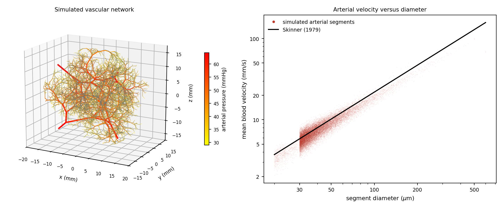
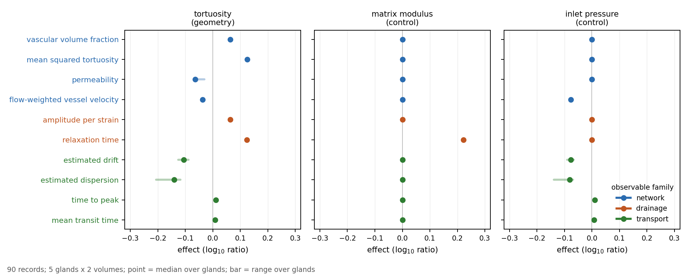
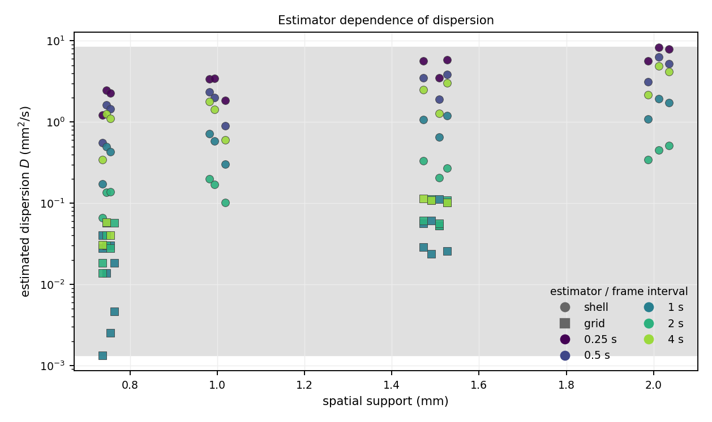

# Vascular-network coupling: results

## 1. Simulated network

The simulated prostate gland is a 22 mL ellipsoid supplied by four 600 µm
feeding arteries representing the four arterial pedicles
([García-Mónaco et al., 2014](https://doi.org/10.1016/j.jvir.2013.10.026)). It contains
approximately 54,900 arterial and venous segments. Flow is driven by fixed
arterial and venous pressures and a calibrated terminal-bed conductance.



**Figure 1.** Simulated prostate gland and arterial velocity as a function of
vessel diameter.

Selected outputs were compared with published physiological values.

| Quantity | Simulation | Published comparison |
|---|---:|---|
| perfusion | 20.2 mL/min/100 g | 15-20 mL/min/100 g for normal prostate ([Vaupel and Kelleher, 2013](https://doi.org/10.1007/978-1-4614-4989-8_42)) |
| velocity-diameter relation | median simulated/reference ratio 0.92 | relation fitted by [Skinner (1979)](https://doi.org/10.3109/14639237909017762) to microcirculatory measurements from [Zweifach and Lipowsky (1977)](https://doi.org/10.1161/01.RES.41.3.380) |
| feeder-to-terminal transit time | 1.34 s | 1.14 ± 0.26 s in renal cortex ([Kim et al., 2017](https://doi.org/10.1002/jmri.25634)) |
| venular-end pressure | 12.6 mmHg | 18.9 ± 1.6 mmHg in human postcapillary venules ([Parazynski et al., 1993](https://doi.org/10.1152/jappl.1993.74.2.946)) |
| capillary equivalents per terminal arteriole | 7.0 | 24-40 in hamster skeletal muscle ([Delashaw and Duling, 1988](https://doi.org/10.1016/0026-2862(88)90016-7)) |

The last quantity is inferred from the lumped terminal-bed conductance and
depends strongly on the assumed capillary diameter. These comparisons concern
different organs and establish only the approximate physiological scale of the
simulated network.

## 2. Paired perturbation study

Five prostate-gland realizations with two sampling volumes each were evaluated
at baseline and after eight predefined parameter changes. Each changed
condition was compared with a matched baseline generated using the same random
seed. Sampling volumes, input voxels, and terminal-bed calibration were held
fixed, so only the specified model parameter differed.

The primary comparison increased the path-to-chord tortuosity parameter from
1.25 to 1.45, corresponding to a 16% increase. Control comparisons changed only
the matrix modulus or only the arterial inlet pressure.



**Figure 2.** Effects of increased vascular tortuosity and the two control
changes. Dots show the median base-10 logarithmic effect across five paired
prostate-gland realizations; bars show the range.

| Quantity | Median log10 effect | Change on the original scale |
|---|---:|---:|
| vascular volume fraction | +0.063 | +16% |
| mean squared tortuosity | +0.125 | +33% |
| network permeability | -0.065 | -14% |
| vascular-compliance relaxation time | +0.124 | +33% |
| estimated transport drift | -0.105 | -22% |
| estimated transport dispersion | -0.140 | -28% |

All tortuosity effects had the same sign in the five realizations. Changing the
matrix modulus altered the relaxation time but left vascular geometry, flow,
and contrast transport unchanged. Changing the arterial inlet pressure altered
flow and transport but left vascular geometry and compression relaxation
unchanged.

The relaxation-time effect closely matched the change in mean squared
tortuosity and was larger than the change predicted from inverse permeability
alone. Within this model, this is consistent with a relaxation time dominated
by vascular path length.

The equilibrium drainage amplitude increased with vascular volume fraction by
construction through the prescribed compliance law. It is therefore an
implementation check and is not treated as separate evidence of coupling.

## 3. Dependence on the transport estimator

The same simulated contrast dataset was analyzed by two different approaches to estimate dispersion. 
Hereafter, we refer to the 3D implementation of the shell-kernel system-identification
approach proposed by
[van Sloun et al. (2017)](https://doi.org/10.1016/j.media.2016.09.010) as the
**shell estimator**, and to the 3D convection-dispersion partial-differential-
equation approach proposed by
[Wildeboer et al. (2018)](https://doi.org/10.1109/TMI.2018.2843396) as the
**grid estimator**. The vascular network and contrast curves were held fixed;
only the estimator and analysis settings varied. The comparison covers 96
combinations of spatial support, derivative scale, transfer function, causality
rule, and frame interval.



**Figure 3.** Dispersion estimated from the same simulated contrast dataset
using the shell estimator (circles) and grid estimator (squares). Color denotes
the frame interval. Spatial support is the shell radius for the shell estimator
and the Gaussian derivative scale $\sigma_x$ for the grid estimator. Across the
96 settings, estimated dispersion ranged from 0.0013 to 8.3 mm²/s.

Estimated dispersion ranged from 0.0013 to 8.3 mm²/s. The systematic difference
between the two estimators and the variation across settings show that the
recovered drift and dispersion depend on both the network and the analysis used
to estimate them.

## 4. Interpretation

The paired study provides an example in which one change in vascular
organization affects a mechanical observable and contrast-transport descriptors
in the same network. The control conditions distinguish this shared structural
dependence from changes confined to mechanics or flow.

## 5. Limitations

The results are based on one geometric perturbation (tortuosity) and five prostate-gland
realizations. Three additional geometric changes were evaluated: shorter segments relative
to vessel diameter, more asymmetric branching, and termination of the explicit
gland-scale network at 40 rather than 30 µm. These changes altered which voxels
returned valid transport estimates; for example, the proportion of valid input
voxels decreased from 62% at baseline to 51% with greater branching asymmetry
and 38% with shorter segments. Consequently, the paired analyses compared
different and sometimes small subsets of voxels, and the estimated effects
varied across prostate-gland realizations. Future analyses should use smaller
geometric changes that preserve voxel-wise pairing while remaining large enough
to exceed between-realization variability.

The vascular-compliance model uses a rigid tissue matrix, and the
transport model contains no ultrasound measurement operator. The observed
associations do not establish joint identifiability or physiological effect
sizes.

## 6. Reproduction

```bash
pip install -e .
pytest -q
python -m porovasc.validate runs/coupling
python -m porovasc.analyse_coupling runs/coupling
python -m porovasc.figures --out figures
```

The numerical records are stored in `runs/coupling/`.
