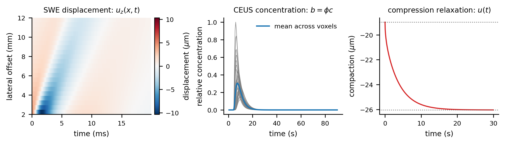
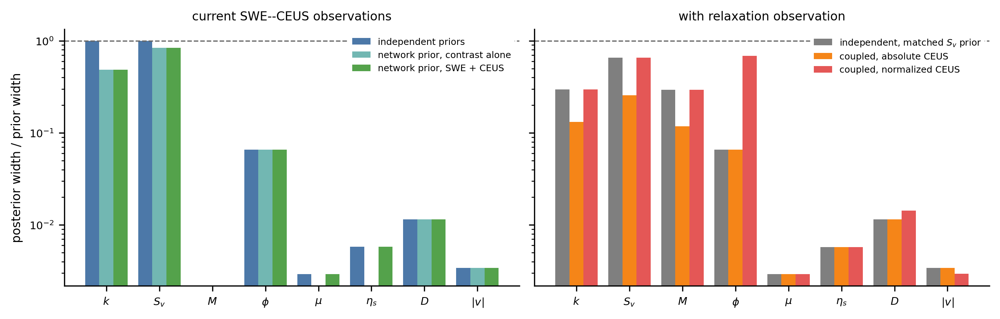
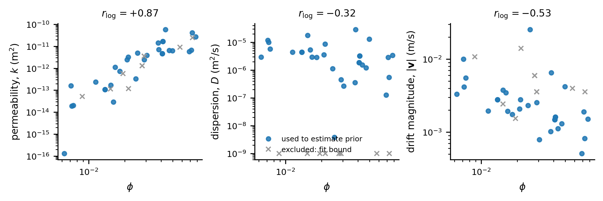

# Multiphysics field identifiability: results

## 1. Study design

The inverse problem combines three idealized observations from one homogeneous
tissue region: shear displacement, tissue-averaged microbubble concentration,
and pressure-driven relaxation. Further details on the simulation of these
fields, parameter coupling, noise, and analysis settings are provided in the
[Methods](METHODS.md).



**Figure 1.** Simulated SWE displacement, tissue-averaged microbubble
concentration, and compression-relaxation displacement at the reference
parameter setting. Gray concentration curves represent individual voxels and
the blue curve their mean. For display only, the concentration curves are
scaled by their maximum across all voxels; the inference uses the unscaled
fields. Dotted lines indicate the initial and long-time compaction limits.

The analysis compares eight configurations that differ in the observations
included, the relation used for vascular storage, and whether a
network-informed joint prior is applied. Posterior contraction is defined as
the 90% posterior interval width divided by the corresponding prior interval
width.

The robustness analysis evaluates the eight configurations at nine parameter
settings with five paired noise realizations, for a total of 360 fits.

## 2. Contrast amplitude and vascular volume fraction

The absolute contrast field contains the amplitude factor $\phi A$. Without
independent information about the input concentration $A$, the observation does
not distinguish $\phi$ from $A$. When $A$ is calibrated, $\phi$ contracts to
6.4--7.1% of its prior width across all nine parameter settings.

Normalizing each contrast curve by its temporal integral removes the factor
$\phi A$. The normalized curves retain information about $D$, $\mathbf v$, and
$t_0$, but no longer constrain $\phi$.

## 3. Effective permeability

Under the tested SWE--CEUS model, $k$ remains at 99.8--100% of its prior width
across the nine parameter settings. The shear observation has only weak
sensitivity to $k$, and the contrast model contains no direct dependence on it.

Adding the relaxation observation provides information about combinations of
$k$, $S_v$, $M$, $L$, and the applied stress. At the reference setting, the
relation $S_v=\phi C_v$, together with independent constraints on $A$, $L$, and
$C_v$, reduces the posterior width of $k$ by a factor of 2.25 relative to the
matched independent model. Posterior sampling gives the same result as the
Laplace approximation.

Across the parameter sweep, the gain is 2.0--2.3 in seven settings and
approximately 1.2 in two settings where relaxation is incomplete within the
30-s observation.



**Figure 2.** Posterior contraction for only SWE--CEUS observations
(left) and after adding relaxation (right); lower values indicate narrower
posterior intervals. Missing bars denote parameters that are not estimated in a
given configuration: $M$ enters only when relaxation is included, while
$\mu$ and $\eta_s$ are absent from the CEUS-only configuration. Colors denote
different configurations and are therefore distinct between panels.

In the left panel, the network-informed prior mainly constrains $k$ and, more
weakly, $S_v$. It has little visible effect on $\phi$, $\mu$, $\eta_s$, $D$,
and $|\mathbf v|$ because these parameters are already strongly constrained by
the corresponding observations at the reference setting.

## 4. Network-informed relation

The vascular-network ensemble produced a correlation of 0.873 between
$\log\phi$ and $\log k$, with a conditional spread of 0.487.



**Figure 3.** Log-space relations between vascular volume fraction and
effective permeability $k$, dispersion $D$, and drift magnitude
$|\mathbf v|$ in the network ensemble. Blue points are used to estimate the
joint prior; gray crosses are excluded because at least one fitted quantity is
on its prescribed fit bound. $r_{\log}$ is the Pearson correlation between the
log-transformed quantities.

Applying this relation as a fixed joint prior reduces the posterior width of
$k$ to 0.47--0.49 of its prior width. At parameter settings inconsistent with
the learned relation, however, the prior pulls the posterior toward that
relation rather than toward the generating value. The largest displacement of
the posterior median is 3.7 in natural-logarithmic units, corresponding to a
factor of approximately 40. Because uncertainty in the learned relation is not
modeled, the posterior remains narrow and does not reveal the misspecification.
Thus, modeled parameter coupling can reduce posterior width, but an incorrect
or overconfident coupling relation can introduce substantial bias.

## 5. Model discrepancy

A finite-width shear push, two-pathway transport, and distributed relaxation
are introduced separately in the data-generating model and fitted with the
reduced inversion model.

The finite-width push produces the largest error. Shear viscosity is estimated
approximately 35% below its generating value, while the residual cost is only
8% above the expected noise level. Weakly constrained parameters, particularly
$\phi$ and $k$, absorb much of the discrepancy. Joint inversion changes the
distribution of this error because the contrast observation independently
constrains $\phi$.

The two-pathway transport and distributed-relaxation departures produce smaller
biases at the tested setting. These results show that a good residual fit is not
sufficient to exclude parameter bias when some directions are weakly
constrained.

## 6. Interpretation

The study examines two routes by which information transfers between measurements: 
a constitutive relation, in which one tissue parameter is defined in terms of another, 
and a statistical relation estimated from an ensemble of vascular networks.
A constitutive relation links the contrast-sensitive parameter
$\phi$ to mechanical storage. A joint prior transfers information among
vascular parameters. Both routes can reduce posterior uncertainty, but their
benefit depends on the validity and uncertainty of the assumed relation.

## 7. Limitations

The observations are idealized physical fields rather than ultrasound signals.
The relaxation experiment is a reduced surrogate and is not part of the
baseline SWE--CEUS acquisition. The network-informed relation is estimated from
six simulated networks and its uncertainty is not propagated. The nine
parameter settings and five paired noise realizations provide a robustness
analysis, not a physiological population or an independent coverage study.

## 8. Reproduction

```bash
pip install -e .
pytest -q
fieldid matrix      --out results --profile k --profile phi --profile S_v
fieldid discrepancy --out results
fieldid profiles    --out results --profile k --domain-check
fieldid mcmc        --out results --steps 14100
fieldid truth-sweep --out results/truth_sweep_r5 --n-rep 5
fieldid figures     --out figures --results results
```

Numerical outputs are stored in `results/`; the sweep records are in
`results/truth_sweep_r5/`.
