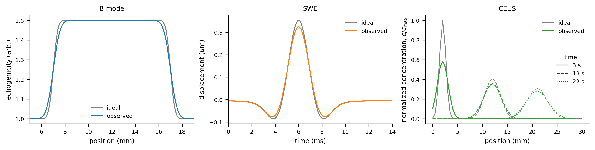
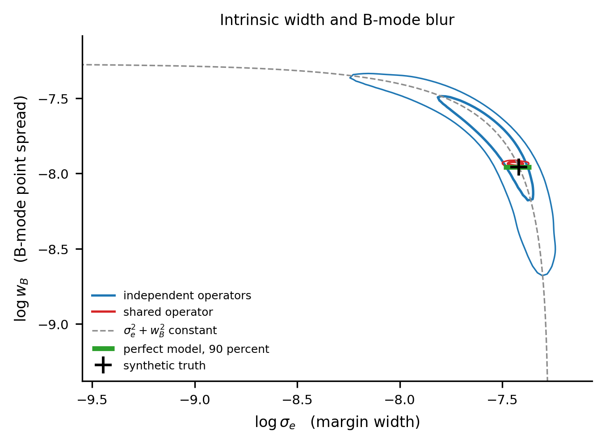
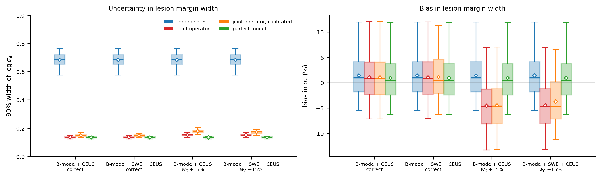

# Shared-operator identifiability: results

## 1. Study design

Three reduced observations are generated from the same image region. B-mode
contains an intrinsic lesion margin, a contrast bolus drifts and disperses
through the region, and a shear pulse propagates across it. The tissue
parameters of these observations are separate. Only the measurement operator is
shared.



**Figure 1.** Reduced B-mode, SWE, and CEUS observations before and after
spatial convolution. In the CEUS panel, solid, dashed, and dotted lines denote 
successive observations at 3, 13, and 22 s;
they do not represent recirculation.

## 2. Structural ambiguity in B-mode

The B-mode profile depends on the intrinsic margin width $\sigma_e$ and image
width $w_B$ through

$$
\sqrt{\sigma_e^2+w_B^2}.
$$

Different pairs with the same quadrature sum produce identical profiles. The
noise-scaled Jacobian reproduces this analytic null direction, with its smallest
singular value equal to $3.7\times10^{-9}$ of the largest. Increasing the
signal-to-noise ratio therefore cannot separate the two quantities.

The contrast time series provides complementary operator information because
its observed variance is

$$
2D(t-t_0)+w_C^2.
$$

Dispersion determines the temporal slope of the variance, while the 
image blur determines the intercept. This separation disappears when 
the time series is replaced by one frame.

## 3. Operator-sharing comparison

The same observations were analyzed with four operator models.

| Model | Image-width relation |
|---|---|
| independent | separate widths for the three observations |
| shared | one aperture width with fixed sequence corrections |
| shared calibrated | one aperture width with estimated sequence corrections |
| perfect model | generating widths supplied as a reference |

The sequence-specific scaling factors $\gamma_C$ and $\gamma_S$ relate each sequence's image width to the shared aperture width $w_0$. The aperture-limited width scales approximately with wavelength and therefore inversely with transmit frequency; the ratios $f_B/f_C$ and $f_B/f_S$ represent this dependence. The scaling factors describe residual departures from frequency scaling. A value of one means that transmit frequency alone accounts for the difference between sequences.

These factors represent sequence-specific effects not captured by transmit frequency, including aperture apodization, pulse length and bandwidth, transmit and receive beamforming, and receive filtering. B-mode defines the reference width $w_0$ and therefore has no additional scaling factor. For SWE, the tracking-kernel width is added separately.

Each scaling factor has a 90% calibration-prior interval from $1/1.10$ to $1.10$. They can be constrained through phantom measurements but, as the next section shows, cannot be determined from the imaging observations alone.



**Figure 2.** Joint posterior of intrinsic lesion-margin width and B-mode image
width for one noise realization. The small offset of the joint-model posterior from 
the synthetic truth reflects the particular noise realization shown. Across 40 noise 
realizations, its mean bias in $\sigma_e$ was only $-0.7\%$, equal to that 
of the perfect model at the reported precision.

The sampled 90% interval for $\sigma_e$ was 0.164-0.689 mm with independently-modeled
operators and 0.548-0.633 mm with the jointly-modeled operator. The interval width was
reduced by approximately one order of magnitude and was within approximately
10% of the perfect-model result.

The contrast image width was constrained similarly in the independent and
joint models. The difference in $\sigma_e$ therefore results from transferring
the contrast-derived operator information to B-mode through the shared relation.
SWE also transferred operator information: with B-mode and SWE alone, joint modeling 
reduced the mean interval width from 0.70 to 0.26 in $\log\sigma_e$. With CEUS
already present, however, adding SWE produced no further reduction because the
contrast time series supplied the stronger constraint on image width.

The Laplace approximation underestimated the width of the curved independent
posterior. The reported interval reduction is consequently based on direct
posterior sampling and is stated approximately.

## 4. Calibration and misspecification

When the common aperture width and sequence-specific scaling factors are estimated from the imaging observations alone, the observations constrain only their combinations, such as

$$
w_C=\gamma_C\frac{f_B}{f_C}w_0,
$$

rather than $w_0$ and $\gamma_C$ separately. Calibration priors constrain this ambiguity while allowing departures from nominal frequency scaling.



**Figure 3.** Distribution of the 90% posterior interval width and bias in lesion margin width across 40 paired noise realizations. Boxes show the interquartile range, horizontal lines the median, diamonds the mean, and whiskers 1.5 times the interquartile range. The same B-mode and CEUS noise realizations are used in the corresponding acquisitions with and without SWE. In the misspecified cases, only the CEUS image width used to generate the observations is 15% larger than specified by the assumed joint operator relation; the B-mode and SWE operators are unchanged.

With the correct relation, joint operator modeling reduced the mean interval width from 0.68 to 0.14 in $\log\sigma_e$. Its bias distribution closely matched that of the perfect model, with a mean bias of approximately 1%. When the generated CEUS width was 15% larger than assumed, the joint model retained a narrow interval but underestimated $\sigma_e$ by approximately 4.5% on average. Estimating the sequence-specific scaling factors widened the interval but only modestly reduced this bias under the tested calibration priors. Adding SWE had negligible influence when the relation was correct and did not reveal the CEUS-specific misspecification, because the CEUS time series provided most of the information about image width in this reduced model.
As expected, for observations generated and inverted with the same model, joint operator modeling did not materially change the mean bias. Its benefit was to resolve the tissue–operator ambiguity, reducing uncertainty without introducing systematic error.

## 5. Interpretation

Within the reduced model, a measurement that resolves a shared operator
parameter can reduce confounding in another measurement that cannot resolve it
independently. The comparison also shows that incorrect joint modeling may increase
precision while introducing bias. Sequence-specific deviations must therefore
be represented with adequate flexibility and constrained by sufficiently
informative calibration data.

## 6. Limitations

The operator contains only Gaussian spatial convolution and nominal frequency
scaling. It does not represent complete ultrasound acquisition or
reconstruction. Noise is independent across 9,721 samples, which affects the
numerical contraction. The repeated-noise summaries use 40 simulations.
These results demonstrate operator-mediated information transfer in the
specified analytic model; they do not establish its magnitude in experimental
ultrasound data.

## 7. Reproduction

```bash
pip install -e .
pytest -q
operatorid matrix    --out results --profile sig_e
operatorid coverage  --out results --n-rep 40
operatorid mcmc      --out results --steps 60000
operatorid figures   --out figures --results results
```

Numerical outputs and posterior samples are stored in `results/`.
