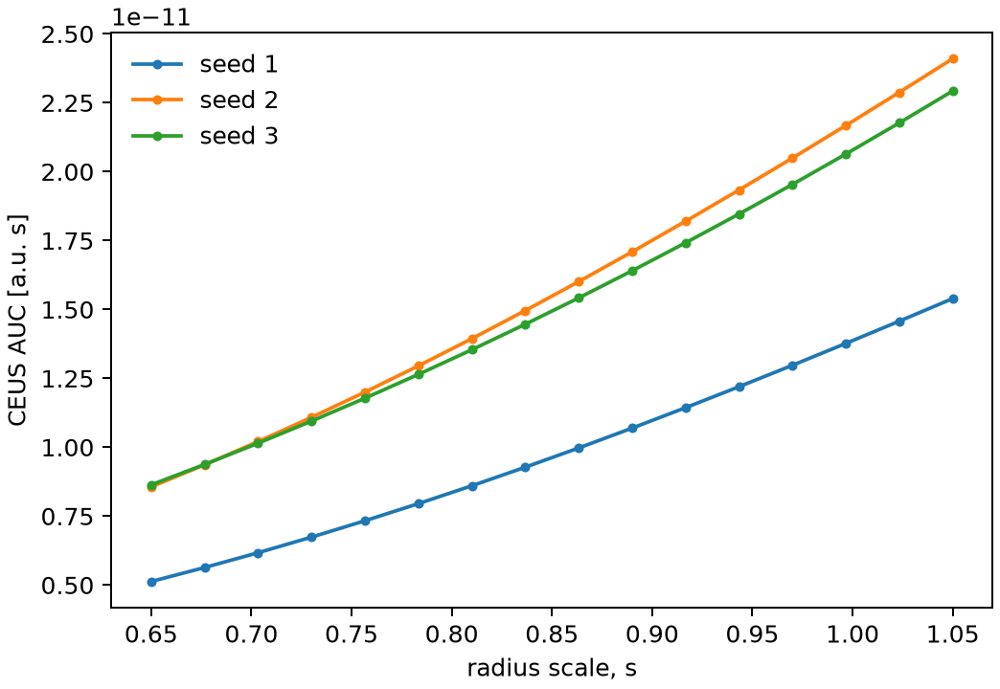
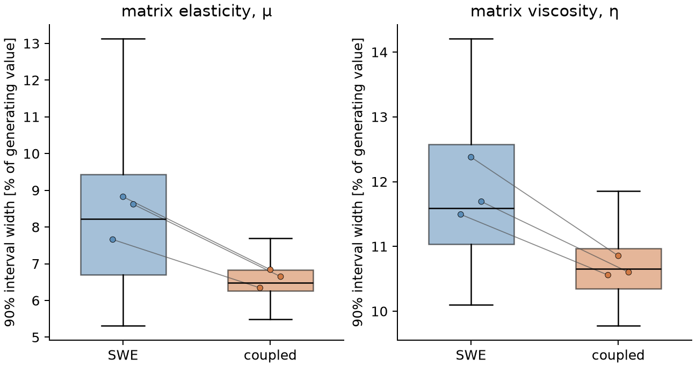
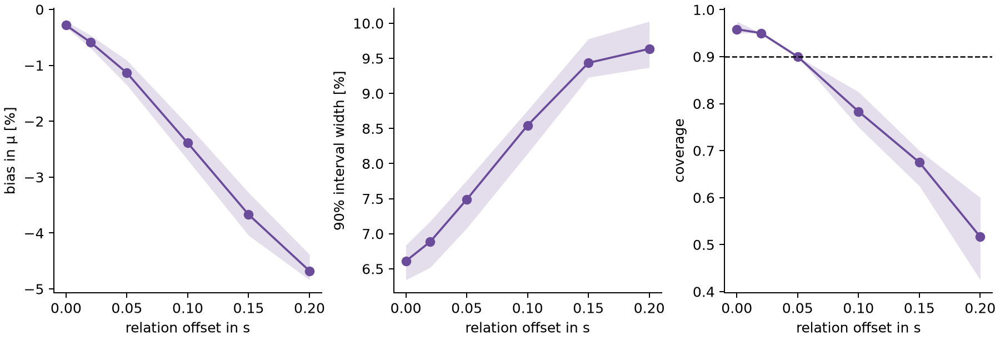
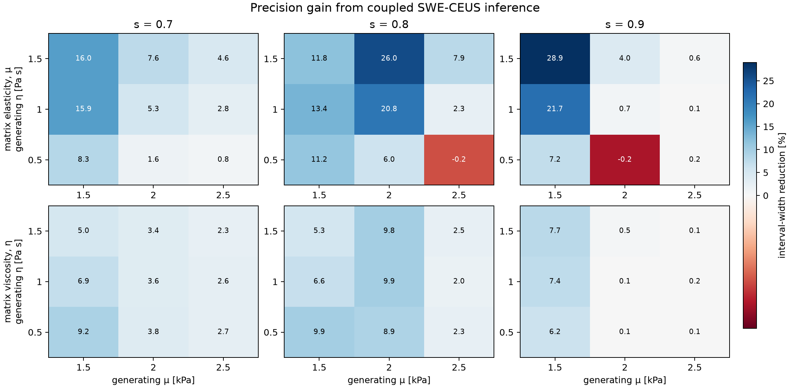

# Vascular-mechanical confounding: results

## 1. Study design

Three vascular-network realizations were evaluated at 30 µm explicit terminal
diameter. For each network, the CEUS AUC was tabulated over the vascular radius
scale and the six inference models were evaluated for 40 paired noise
realizations. The generating tissue had matrix shear modulus 2 kPa, matrix
viscosity 1 Pa s, radius scale $s=0.8$, and a vascular contribution equal to
20% of the baseline loss modulus at 200 Hz. The model definitions and their
literature basis are given in [`METHODS.md`](METHODS.md).

## 2. Network-derived CEUS response

The CEUS AUC increased monotonically with $s$ in all three network
realizations over $0.65\leq s\leq1.05$. Its absolute value varied across
networks, so each inference used the response table generated from the matching
network realization.

**Figure 1.** Network-derived CEUS AUC against radius scale for three network
realizations. Values are medians of the AUCs calculated at eight nearby
input-voxel locations.

## 3. Coupled inference

With SWE alone, multiple combinations of matrix properties and radius scale
fitted the data similarly well. Adding CEUS without a shared radius scale did
not change the SWE posterior, as expected for the uncoupled control. Applying the
cross-modality relation reduced uncertainty in the matrix parameters.

The radius scale is an intermediate nuisance parameter, not a direct CEUS
measurement. Its inference assumes that the calibrated, network-specific
relationship between AUC and radius scale is known and applicable. Since this
relationship is assumed known, the main comparison reports the matrix
parameters rather than treating the radius scale as a directly measured
quantity.

| Quantity | SWE interval width | Coupled interval width | Reduction |
|---|---:|---:|---:|
| matrix elasticity $\mu$ | 7.7-8.8% | 6.3-6.8% | 17-23% |
| matrix viscosity $\eta$ | 11.5-12.4% | 10.6-10.9% | 8-12% |

Widths are normalized by the generating value and ranges span the three network
realizations. Coverage of the coupled 90% interval was 0.95-0.975 for $\mu$ and
0.975 for $\eta$, compared with 0.90-0.925 and 0.925, respectively, for SWE
alone. Across all 120 noise repetitions, the median interval width decreased
from 8.22% to 6.49% for $\mu$ and from 11.59% to 10.65% for $\eta$.

**Figure 2.** Distribution of 90% interval widths for matrix elasticity and
viscosity under SWE-only and coupled SWE-CEUS inference. Each boxplot pools 40
paired noise repetitions from each of three network realizations. Boxes span the
interquartile range, central lines show medians, and whiskers extend to the most
extreme values within 1.5 times the interquartile range; outliers are not shown.
Grey lines connect the network-specific means.

## 4. Coupling-relation sensitivity

A displaced AUC-to-radius-scale relationship biased the inferred matrix
elasticity and progressively reduced coverage. At an offset of 0.10, elasticity
coverage was 0.75-0.825 across networks, compared with 0.95-0.975 for the
specified relationship. Larger offsets produced greater bias and further
coverage loss. These results are conditional on the assumed relationship;
offsetting it tests the consequence of using an incorrect calibration. Interval
width alone did not diagnose the failure because the misspecified posterior
remained relatively narrow.

**Figure 3.** Matrix-elasticity bias, interval width, and coverage as the assumed
AUC-to-radius-scale relationship is displaced. Lines show means and shaded
regions show the range across the three network realizations. The dashed line
marks the nominal 90% coverage.

## 5. Robustness across generating parameters

The precision gain varied across the 27 generating-parameter combinations.

| Parameter | Median reduction | Interquartile range | Full range |
|---|---:|---:|---:|
| matrix elasticity $\mu$ | 5.95% | 1.19-12.56% | -0.20-28.95% |
| matrix viscosity $\eta$ | 3.55% | 2.13-7.13% | 0.11-9.93% |

- The interval became narrower in 25 of 27 combinations for $\mu$.
- The interval became narrower in all 27 combinations for $\eta$.
- The reduction exceeded 5% in 15 of 27 combinations for $\mu$ and 12 of 27
  for $\eta$.

**Figure 4.** Reduction in mean 90% posterior-interval width when adding CEUS
to SWE. Columns show the generating radius scale; horizontal and vertical axes
show the generating matrix elasticity and viscosity. Each cell is the mean of
the percentage reductions calculated separately for the three networks, with
40 paired noise repetitions per network. Positive values indicate narrower
intervals under coupled inference.

## 6. Interpretation

Within the reduced model, a transport observation that constrains the radius
scale can reduce its confounding with matrix parameters in a mechanical
observation.
The uncoupled control shows that the gain comes from the cross-modality relation,
not from adding an unrelated dataset. Across the generating-parameter sweep,
adding CEUS reduced posterior interval widths over most of the evaluated grid,
while the magnitude depended on the matrix properties and radius scale. The
median reductions were 5.95% for matrix elasticity and 3.55% for matrix
viscosity. The offset sweep shows the corresponding risk: an incorrect relation
can increase apparent precision while reducing coverage.

## 7. Limitations

The vascular contribution to shear is assumed rather than derived from a
fluid-solid solve on the network. Frequency limits of the associated
microchannel framework are discussed by
[Parker (2017)](https://doi.org/10.1088/1361-6560/aa62b2). Transport includes an
unresolved distal bed that is absent from the mechanical calculation. Only three
networks, one sampling region per network, and 40 noise realizations per network
are included. The observations omit ultrasound signal formation and use
calibrated CEUS amplitude. Numerical uncertainty reductions therefore apply to
this simulation and should not be interpreted as experimental performance
estimates.

## 8. Reproduction

The commands are listed in [`README.md`](README.md). Final CEUS response tables,
noisy observations, repetition-level posterior summaries, aggregate summaries,
and diagnostics are stored in `results/`; figures are generated by
`run_figures.py` and `run_sweep_figures.py`.
